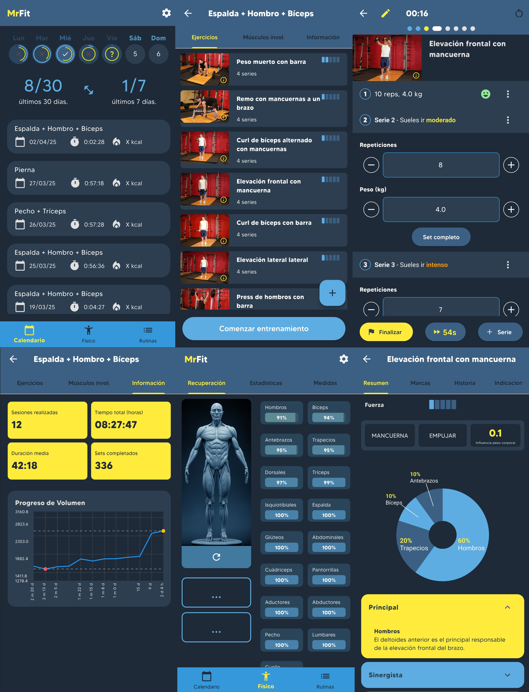

# MrFit

MrFit es una aplicación de entrenamiento personalizada que permite gestionar rutinas, seguir el progreso de los ejercicios y utilizar funcionalidades de voz para guiar al usuario. Con Flutter y SQLite como base, ofrece una experiencia multiplataforma sencilla de configurar.

## Tour por la app


## Capturas de pantalla



## Características principales
- Gestión de rutinas diarias de entrenamiento.
- Integración con voz para indicar repeticiones, peso y series a realizar.
- SQLite para guardar y consultar ejercicios.
- Interfaz intuitiva con animaciones y filtros avanzados para encontrar ejercicios.

## Requisitos
- Flutter SDK instalado.
- IDE o editor con soporte para Flutter (VSCode, Android Studio, etc.).

## Instalación
1. Clona este repositorio en tu máquina local.
2. Abre el proyecto en tu IDE.
3. Ejecuta en la terminal:
   ```
   flutter pub get
   ```
4. Ejecuta el siguiente comando para confirmar que tienes todo:
   ```
   flutter doctor
   ```

## Ejecución
1. Conecta un dispositivo o emulador.
2. Compila y ejecuta la app:
   ```
   flutter run
   ```
### Ejecución con adb
0. Conecta el USB
1. adb tcpip 5555
2. adb shell ip route
3. adb connect 192.168.1.62
4. adb devices
5. flutter run

## Compilación para producción
Para generar un APK release:
```
flutter build apk --release
```

Para más herramientas y configuración avanzada, consulta la documentación oficial de Flutter.

## Ajustes en VSCode
1. Abre el archivo `settings.json` del VSCode.
2. Añade las siguientes configuraciones:
   ```json
   "github.copilot.chat.codeGeneration.useInstructionFiles": true,
   "github.copilot.chat.commitMessageGeneration.instructions": "Follow the Conventional Commits format. Be clear and use the following prefixes:\n\nfeat: New feature → feat: add login button\nfix: Bug fix → fix: resolve crash on submit\ndocs: Documentation only changes → docs: update README\nstyle: Changes that do not affect the code meaning (formatting, etc.) → style: format code\nrefactor: Code changes that neither fix a bug nor add a feature → refactor: simplify logic\nperf: Performance improvements → perf: optimize image loading\ntest: Adding or updating tests → test: add unit tests for auth\nchore: Minor tasks or maintenance (build, dependencies, etc.) → chore: update dependencies\nbuild: Changes that affect the build system (webpack, ddev, etc.) → build: update Dockerfile\nci: Continuous Integration changes → ci: fix GitHub Actions script",
   "github.copilot.chat.pullRequestDescriptionGeneration.instructions": "Summarize the main changes in one paragraph, then use bullet points to explain each individual change. Finally, add a summary if any additional commands need to be executed after installing the Pull Request.",
   ```
3. Esto funcionará por tener el fichero `.github/copilot-instructions.md` en la raíz del proyecto.

## Arquitectura general
- Carpeta "models" con los modelos de los contenidos.
- Carpeta "utils" con colores y constantes globales.
- Carpeta "screens" para pintar pantallas organizadas por procesos: entrenamiento, ejercicios, etc.
- Componente de text-to-speech con Flutter TTS.
- Patrones de Estado con StatefulWidgets y Singletons simplificados.

## Conectividad Google Fit
- Aún pendiente de ajustar.

## Contribuciones
¡Las contribuciones a MrFit son bienvenidas! Si encuentras algún problema o tienes sugerencias para nuevas funcionalidades, por favor abre un issue o envía un pull request. Asegúrate de seguir el estilo de código y las directrices del proyecto.

## Disclaimer
MrFit no es una aplicación con propósitos médicos. No podemos confirmar que todos los datos hayan sido validados y deberían usarse con precaución.
Por favor, mantén un estilo de vida saludable y consulta a un profesional si tienes algún problema. No se recomienda su uso durante enfermedades, embarazo o lactancia.
La aplicación aún está en construcción. Pueden ocurrir errores, fallos y cierres inesperados.

## Agradecimientos
Se agradece a toda la comunidad de Flutter y a los desarrolladores de paquetes de terceros que hicieron posible crear una experiencia más completa.

## Licencia
Este proyecto está disponible bajo los términos de la licencia que se especifica en el repositorio. Revisa el archivo LICENSE para más detalles.
Imagen modelo basada en: https://www.artstation.com/artwork/rVqBe