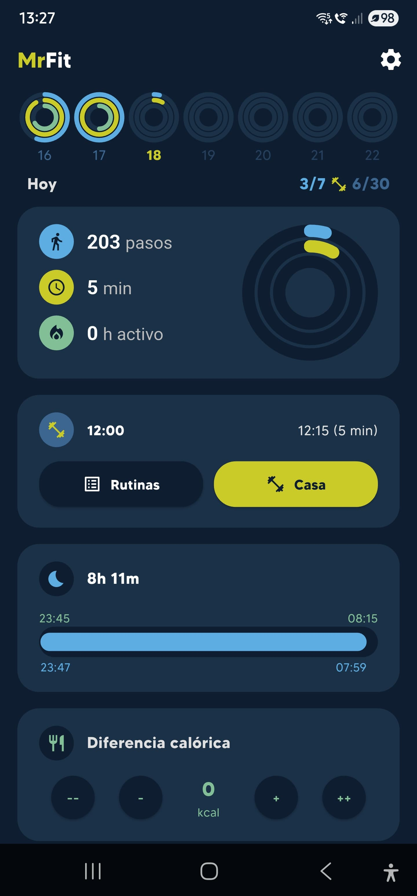

# MrFit

Este proyecto está creado con Flutter. A continuación se describen los pasos básicos para ejecutar la aplicación.

## Capturas de pantalla
A continuación, se muestran algunas capturas de pantalla de la aplicación:

<div style="display: flex; flex-wrap: wrap; gap: 10px;">

<div style="flex: 1; max-width: 48%;">

<p style="text-align: center;">Pantalla de inicio</p>
</div>

<div style="flex: 1; max-width: 48%;">

<p style="text-align: center;">Listado de ejercicios</p>
</div>

<div style="flex: 1; max-width: 48%;">

<p style="text-align: center;">Entrenamiento</p>
</div>

<div style="flex: 1; max-width: 48%;">

<p style="text-align: center;">Resumen del entrenamiento</p>
</div>

<div style="flex: 1; max-width: 48%;">

<p style="text-align: center;">Recuperación muscular</p>
</div>

<div style="flex: 1; max-width: 48%;">

<p style="text-align: center;">Detalle del ejercicio</p>
</div>

<div style="flex: 1; max-width: 48%;">

<p style="text-align: center;">Historia</p>
</div>

</div>

## Explicación del proyecto
MrFit es una aplicación de entrenamiento personalizada que permite gestionar rutinas, seguir el progreso de los ejercicios y utilizar funcionalidades de voz para guiar al usuario. Con Flutter y SQLite como base, ofrece una experiencia multiplataforma sencilla de configurar.

## Características principales
- Gestión de rutinas diarias de entrenamiento.
- Integración con voz para indicar repeticiones, peso y series a realizar.
- SQLite para guardar y consultar ejercicios.
- Interfaz intuitiva con animaciones y filtros avanzados para encontrar ejercicios.

## Requisitos
- Flutter SDK instalado.
- IDE o editor con soporte para Flutter (VSCode, Android Studio, etc.).

## Instalación
1. Clona este repositorio en tu máquina local.
2. Abre el proyecto en tu IDE.
3. Ejecuta en la terminal:
   ```
   flutter pub get
   ```

## Ejecución
1. Conecta un dispositivo o emulador.
2. Compila y ejecuta la app:
   ```
   flutter run
   ```

## Compilación para producción
Para generar un APK release:
```
flutter build apk --release
```

Para más herramientas y configuración avanzada, consulta la documentación oficial de Flutter.

## Arquitectura general
- Carpeta "models" con los modelos de los contenidos.
- Carpeta "utils" con colores y constantes globales.
- Carpeta "screens" para pintar pantallas organizadas por procesos: entrenamiento, ejercicios, etc.
- Componente de text-to-speech con Flutter TTS.
- Patrones de Estado con StatefulWidgets y Singletons simplificados.

## Conectividad Google Fit
- Aún pendiente de ajustar.

## Contribuciones
1. Haz un fork de este repositorio.
2. Crea una rama con tu funcionalidad.
3. Envía un pull request con la descripción de tus cambios.

## Agradecimientos
Se agradece a toda la comunidad de Flutter y a los desarrolladores de paquetes de terceros que hicieron posible crear una experiencia más completa.

## Licencia
Este proyecto está disponible bajo los términos de la licencia que se especifica en el repositorio. Revisa el archivo LICENSE para más detalles.
Imagen modelo basada en: https://www.artstation.com/artwork/rVqBe